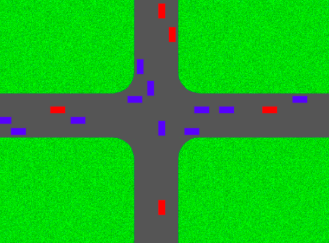

# Intersection management

# Quick start

```
$ docker-compose build
# ...
$ docker-compose up -d
Creating network "smart_city_efk" with the default driver
Creating smart_city_elastic_1 ... done
Creating smart_city_fluentd_1 ... done
Creating smart_city_fe_1      ... done
Creating smart_city_elasticsearch-mapping-init_1 ... done
$ cd algorithm/
$ go build -a -o app .
$ ./app simulation.yml 
26 / 150 [---------------------->__________________________________________________________] 17.33% 2 p/s
```

Go to localhost:3000




